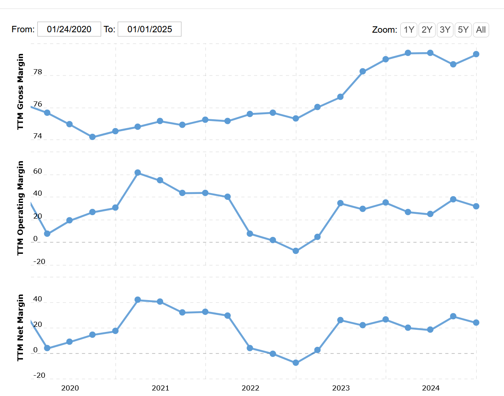

# 📊 Tradeflow ———— Pairs Trading

## 0 Data Aquisition

**Data:**
- News & Sentiment 
- Intraday Data

**Source:** Alphavantage.co ; Interactive Brokers.

**Methods:** 
- API inquiry from course 512
- API inquiry using Shiny Broker and IB workstation

## 1 Statistical Indicators

### 1.1 Correlation Analysis

**Purpose:** Measure the strength of linear relationship between two asset price series.

**Steps:**
- Computed using Pearson correlation.
- Input: Price series of both assets.
- Output: A value between -1 and 1.

### 1.2 Cointegration Test

**Purpose:** Test for long-term equilibrium between two asset price series.

## 2 Trading Signals

**Entry Signal:** 
- Abnormal gap between two assets

**Exit Signal:** 
- Loss at $\alpha %$
- Predicted gap vanish

## 3 Trade Execution
- To be decided

## 4 Performance Metrics
- Overall Profit

- Rolling Delta

| Jan  | Feb  | Mar  | Apr  | May  |
|------|------|------|------|------|
| 1.20 | 0.80 | 0.70 | 1.10 | 1.31 |

- Maxium Drawdown Ratio
