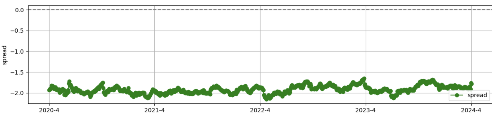
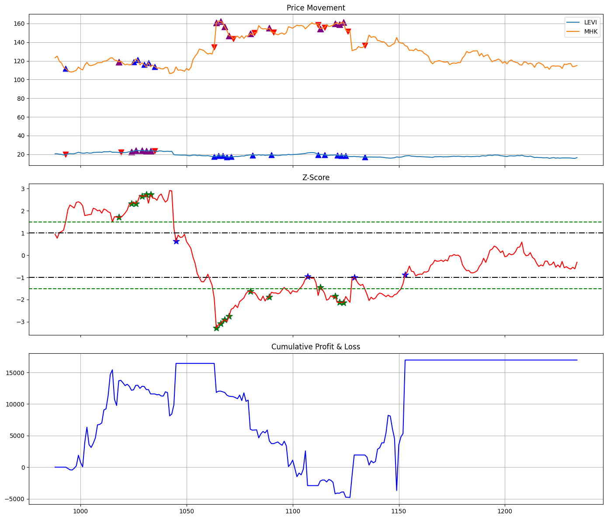
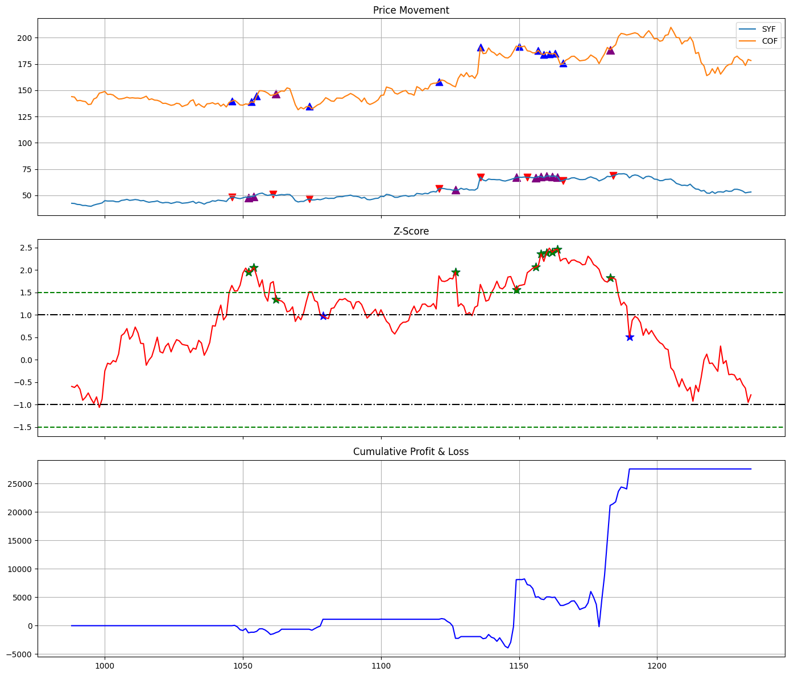

# Finding Pairs
1. We use hieratical clustering to from all the US stocks market to find n = 2 pairs, every pair are closest to each other in terms of historical price
2. After that, we find about 1800 pairs of potential match, then we do cointegration to between them and find over 35+ potential pairs
3. After that, we lock in three pairs: "LEVI" vs "MHK", "SYF" vs "COF", "V" vs "MA"


### Hieratical clustering
1. We use single linkage and only apply first layer for clustering to find closest pair. Specifically, minimum distance between any two points in the two clusters. Unlike K-Means, it does not require the number of clusters to be specified in advance.
2. After that, we apply a min heap data structure to find top 50 most "lease" closest pair, the reason is that if we use max heap, all the 50 pairs are the same company or same asset. Hieratical clustering garuantee us even it's least similar pairs in most similar pairs, it's still close enough. Actually, we can find some typical pairs like "V vs MA" with this method to prove our method's efficiency

### Cointegration and fudemental filter
1. We apply cointegration and find 35+ potential pairs, by checking with ADF test that if the log spread is stationary for pairs.
2. Most of pairs are very similar assets or same company's different class stock, we apply some fundemental approach (choose related company when considering their main business). For example, LEVI is a premium clothing company while MHK is a flooring manufacture company. They are all in regular comsumption company and should in certain extent grow together when macro factor like dropping interest rates and increasing Gini coefficient.

## Data Prepration & Transformation
### Log transformation for spread
We use log spread when checking the spread between two pairs, the reason is that log spread is more stable and it's better to visualize that certain pairs has some stable relationship with their diff

*Figure 1: Spread after log transform*

### Standarization
After log transform, We apply transpose and standarization to before doing clustering to stablize our clustering result

# Trading Strategy
### Hybrid Strategy
Our strategy **hybrid regula pairs trading main reversion and some momentum filtering: trend following**. The reason is that some macro factor may suddenly benefits certain company within the pair and we will close our pairs trading position and switch into trend following (long single side strong trend stock). This strategy is **intraday approach** and will be close next day, the reason is that our main focus is still on pairs trading and trend following is just scalping some short momentum to benefit our portfolio, and it doesn't mean that we think it's not overvalued. 
* We measure trend with:
```data[ticker1].rolling(10).mean() > data[ticker1].rolling(30).mean()) & (data[ticker1].rolling(5).mean() > data[ticker1].rolling(10).mean() ```

* We switch to trend following when one of them has strong trend:
```ticker1_strong_up and not ticker2_strong_up``` or ```ticker2_strong_up and not ticker1_strong_up```

* We switch end trend following when they both don't have strong trend
```ticker1_strong_up and ticker2_strong_up```

## Trading Signal
We made trade every day as long as there is trading signal
### Z score threshold for spread
When there is no active strategy and close action, we will measure the z score of log spread, we use rolling windows with (windows=len(train_data//2)) to better reflect current spread, this **signficantly** enhance our strategy because it's absorb current spread
* We entry pairs trading streategy when:
```current_zscore > 1.5``` or ```current_zscore < -1.5```
We will short the overvalued stock and long the undervalued stock based on position chapter below
* We exit pairs trading streategy when:
```abs(current_zscore)```
We will close all the previous cumulative position and it generally will gain large profit when it hit exit signal

*Figure 2: Test result for LEVI vs MHK (Blue Star in Z score table is when we hit exit signal for pairs trading)*

### Long short position balance:
In order to match price magnitude difference between pairs, we use price ratio to allocate position for pairs. In this way, if there is any **together trend** of going up and down, our portfolio PL should cancel out:

    total_value = price1 + price2
            ticker1_portion = int(100 * price1 / total_value) if total_value > 0 else 0
            ticker2_portion = int(100 * price2 / total_value) if total_value > 0 else 0


# General Feature
### Understanding for mixed strategy
* The role of our short term trend following strategy is actually in order to balance slightly our portfolio in case of any maga news, financial statement surprise, we can see from figure our PnL increase a lot when close position for mean reversion and trend following keeps our portfolio stable when there is single side trend

*Figure 3: Testing for SYF and COF (Purple is trend folllowing, blue is long and red is short)*
### Blotter
We trade every day when there is signal so our average price and position for position is updated and cumulative every day just like real trading:

    data.loc[data.index[i], f'{ticker1}_position'] = curr_position_ticker1 + ticker1_portion
    data.loc[data.index[i], f'{ticker2}_position'] = curr_position_ticker2 - ticker2_portion
    data.loc[data.index[i], f'{ticker1}_cost'] = update_cost(curr_position_ticker1, curr_cost_ticker1, ticker1_portion, price1)
    data.loc[data.index[i], f'{ticker2}_cost'] = update_cost(curr_position_ticker2, curr_cost_ticker2, -ticker2_portion, price2)

### Improvement in the future
1. The biggest improvement we need is still in terms of z score, for some pairs, the price in test time frame is hyped for both stock and our streategy cannot updated the correct z score threshold even if we have rolling windows. A possible improvement on that is probably using **percentile for z score instead of fixed value**
2. We know in 2025 there are a lot of volitility happened and it may cause unexpected loss for our portfolio. Therefore, a careful stop loss should be set and we should close position when VIX is too high